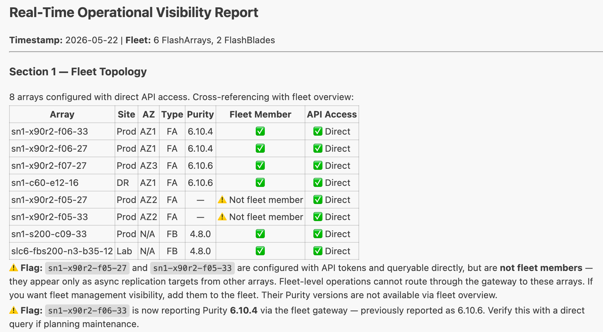

# MCP Server Demos

Demo scripts and skills files for using [Claude Code](https://claude.ai/code) as a Database SRE agent with the Pure Storage Fusion MCP server.

## What's in This Repo

```
CLAUDE.md                  bootstrap — auto-loaded by Claude Code at session start
database-sre-agent.md      the policy file the agent is audited against
.claude/settings.json      project permissions (read-only allowed, mutating tools gated)
demos/
  demo-script.md           technical walkthrough, 8 steps
  customer-runbook.md      customer run-of-show, 6 steps, with talk tracks
  fixtures/
    mock-tickets.md        offline ticketing fixture
scripts/
  fix-fusion-mcp.sh        de-quarantine a freshly downloaded Fusion MCP binary
assets/                    screenshots used by this README
```

| File | Description |
|---|---|
| `CLAUDE.md` | Auto-loaded by Claude Code at session start: bootstraps the agent and points to `database-sre-agent.md` |
| `database-sre-agent.md` | **The policy file.** Encodes SLA tiers, compliance floors, provisioning standards, fleet topology, change management, and the field traps that prevent false passes. Carries a revision header and changelog — this is the file findings are audited against |
| `demos/demo-script.md` | 8-step technical walkthrough: prompts with explanations for each workflow. Step 8 is the agent-driven snapshot that exercises the freeze-safety policy — it mutates state and freezes database I/O, so rehearse it first |
| `demos/customer-runbook.md` | Customer-facing 25-minute run-of-show: prompts, talk tracks, time boxes, fallbacks |
| `demos/fixtures/mock-tickets.md` | Offline ticketing fixture so ticket workflows work without a connected ticketing server. **A demonstration fixture, not a system of record** |
| `.claude/settings.json` | Project permissions: read-only Fusion tools pre-approved; the four state-mutating tools deliberately left in `ask` so the supervised-action gate is visible and verifiable |

### Which demo file do I use?

They are **two different demos**, not two versions of one. Only fleet discovery and compliance &
audit appear in both.

**`demos/demo-script.md`**

| Workflow | Step | Recording
|---|:---:|:---:|
| Fleet discovery | 1 | [Recording](https://youtu.be/pkuaoYiBPZc)
| SQL Server discovery (MSSQL extension) | 2 | [Recording](https://youtu.be/WoZF_fHoCEY)
| Real-Time Operational Visibility | 3 | [Recording](https://youtu.be/6o24gE37fLU)
| Application-consistent snapshot | 4 | [Recording](https://youtu.be/5grbnU82Ics)

**`demos/customer-runbook.md`**

| Workflow | Step | Recording
|---|:---:|:---:|
| Fleet discovery | 1 | [Recording](https://youtu.be/U_XtkOfkg5A)
| Compliance & Audit | 2 | [Recording](https://youtu.be/zgoosBMDtxw)
| Config drift & security posture | 3 | [Recording](https://youtu.be/a0glHrqhcbQ)
| Preset creation | 4 | [Recording](https://youtu.be/LzW_WXOBOxs)
| Dashboard build | 5 | [Recording](https://youtu.be/Ml1WAhL6f0U)
| Build a Remediation Plan | 6 | [Recording](https://youtu.be/CWoODgFupGI)
| Generate Tickets for the Remediation Plan | 7 | [Recording](https://youtu.be/CWoODgFupGI)
| Isolate Tickets Impacting our DR Array | 8 | [Recording](https://youtu.be/hsoEVKYmrBk)


Learning the workflows or testing a change to the policy file → `demo-script.md`.
Presenting to a customer on a clock → `customer-runbook.md`.

## Prerequisites

**Pure Storage Fusion MCP server** configured and running with API tokens for each array in your fleet:

```
~/Library/Application Support/mcp-servers/fusion-mcp/auth-config.json
```

Each entry in `auth-config.json` needs a valid API token for the target array.

**Claude Code** installed and the Fusion MCP server registered in your MCP config.

## Running the Demo

1. Open this folder in VS Code with the Claude Code extension active.
2. `.claude/settings.json` pre-approves the read-only Fusion tools so you are not prompted for each one.
   The four state-mutating tools (`presets_create`, `presets_update`, `workloads_deploy`,
   `create_placement_recommendation`) are in `ask` on purpose — the permission prompt *is* the
   governance demo, and a reviewer can verify the gate by reading the file.
3. Work through the prompts in `demos/demo-script.md` or `demos/customer-runbook.md` in order. Each builds on the previous — see [Which demo file do I use?](#which-demo-file-do-i-use) to pick.

## The Skills File

`database-sre-agent.md` is what turns Claude Code from a generic assistant into a Database SRE agent. `CLAUDE.md` is read automatically at session start and bootstraps the agent by pointing Claude Code to `database-sre-agent.md`. It encodes:

- **Fleet topology**: which arrays are in which availability zones, site assignments, HA placement rules for SQL Server pairs
- **Performance SLA tiers**: Tier 1 (OLTP) < 0.5ms, Tier 2 (general DB) < 2ms, Tier 3 (batch) < 10ms
- **Compliance policy**: Protection Group requirements, snapshot schedules, retention minimums, encryption requirements, volume tagging schema
- **Operational workflows**: Real-Time Operational Visibility, Compliance & Audit, Blast Radius Analysis, Snapshot & Recovery, DR Readiness Check
- **FlashBlade file & object compliance**: database backup landing zones, immutability (versioning, Object Lock, retention lock), SafeMode, and the binding rule that every SQL backup landing zone must replicate to the DR site
- **Provisioning standards & presets**: what a Tier 1/2/3 workload looks like, and the rule that presets are proposed and previewed, never applied without approval
- **Change management**: severity scale, ticket format, which severities file automatically, and the rule that no existing ticket is closed or reprioritised without approval
- **Field traps**: every field whose plain reading produces a confident wrong answer — retention that reports 7 days while holding 3, SafeMode's inverted boolean, replica links reporting `idle` at 480 days of lag, paginated totals understating an array by 48x

### Why the traps section matters

Each entry exists because the field's obvious reading produced a wrong answer against a real fleet. A
compliance report that says PASS when the answer is FAIL is worse than no report, so the policy file
requires the traps be checked before any pass, zero, or empty result is written.

Once the session is open, just ask for a workflow directly:

```
Produce the "Compliance & Audit" report.
```

## Performance SLA Monitoring



## Demo Workflows Covered

1. **Fleet Discovery**: array inventory with Purity versions across the full fleet
2. **SQL Server Discovery**: pull known instances from the MSSQL VS Code extension
3. **Volume Discovery**: find SQL Server vVol volumes using array-side REST filtering
4. **Real-Time Operational Visibility**: health, alerts, capacity, and performance against SLA thresholds
5. **Compliance & Audit**: Protection Group coverage, tagging, replication topology, HA placement, configuration drift
6. **Application-Consistent Snapshot**: trigger a database snapshot via REST API, confirm replication

## Related Posts

- [Using Claude Code as a Database SRE Agent with the Pure Storage Fusion MCP Server](https://www.nocentino.com/posts/2026-05-22-database-sre-agent-claude-code-fusion-mcp/)
- [Managing Enterprise Storage with Pure Storage Fusion in PowerShell](https://www.nocentino.com/posts/2025-08-14-managing-storage-with-fusion-powershell/)
